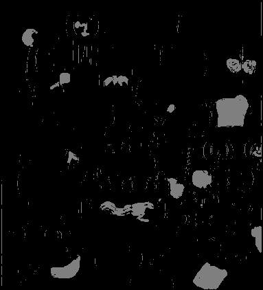
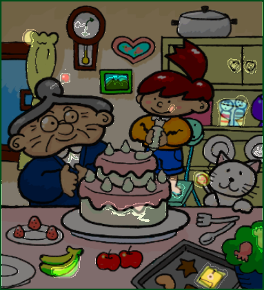

# Image diff finder 📸

remember those newspaper game, where we need to find the difference between the two images.
It was fun, but here comes the image diff finder to kill it.

Using Gaussian Mixture-based Background/Foreground Segmentation Algorithm ( MOG ),
in source code you will find this can be applied using cv2 by calling 
```createBackgroundSubtractorMOG2()``` we can find difference in images.
This can also be used for extracting moving foreground from background, 
or anything moving from a stationary background

here are few examples, and it is pretty fun :

<div align="center">   </div>

after you run the program, on these images we get a mask layer, which show all the differences 
and a image which combines both the images where the difference is found.

<div align="center">   </div>

and this method is fun and really fast, and we can use this method on videos too.
